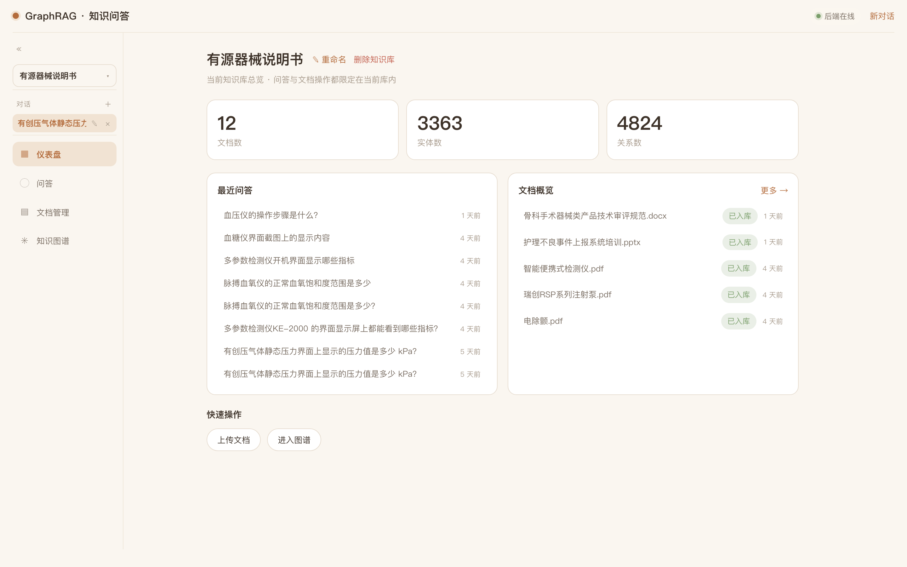
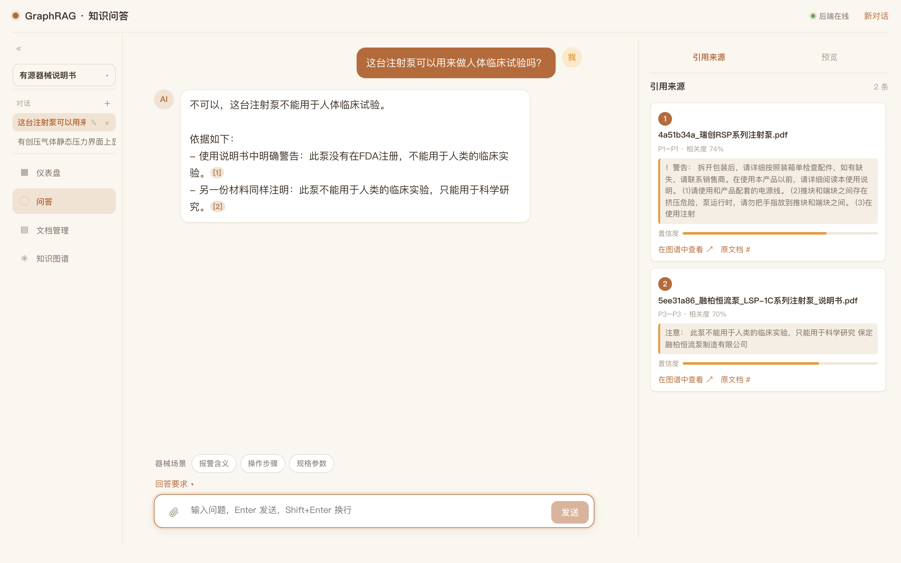
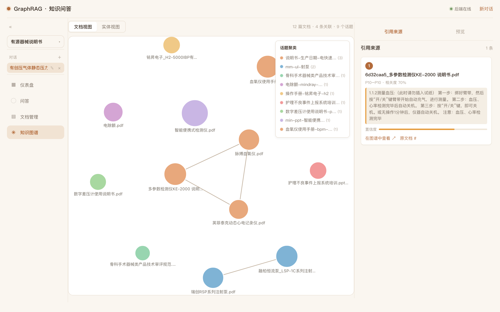
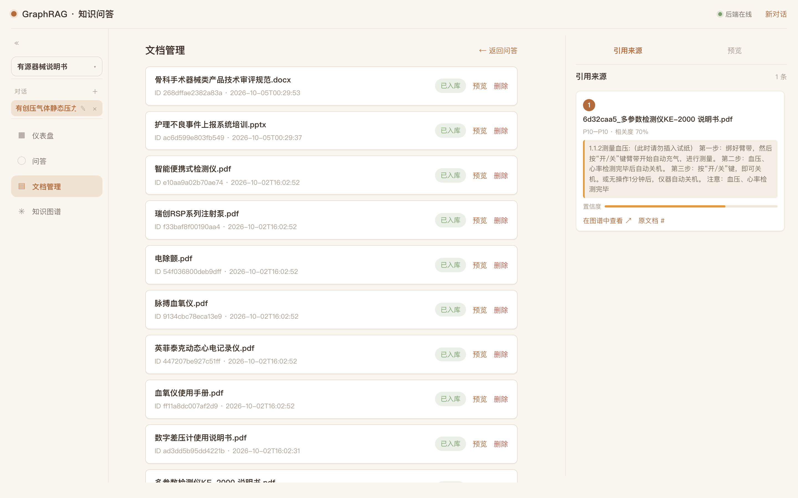

# GraphRAG

面向中文场景的**图增强检索生成（GraphRAG）**系统 —— 基于 LightRAG 内核，支持多格式文档解析入库、双层知识图谱可视化、**多模态图片检索**、SSE 流式问答与 `[n]` 引用溯源。

FastAPI + React/TypeScript 前后端分离；Postgres/pgvector 存储；bge-m3 向量（经 Xinference）；DeepSeek V4-Flash 生成与视觉理解。内置**量化评测体系**（检索 + 生成共八维指标，三库 130 题）。

## 界面预览

| 仪表盘（库概览） | 文档问答（SSE 流式 + `[n]` 引用溯源） |
|---|---|
|  |  |
| 知识图谱（双层图谱：文档级 + 实体级） | 文档管理（上传自动入库 / 软删 / 多库隔离） |
|  |  |

## 功能特性

- **文档问答**：SSE 流式输出，答案带 `[n]` 引用标注，可溯源到原文片段；多文档交叉引用
- **知识图谱**：双层图谱（文档级 + 实体级），力导向布局，支持话题聚类 / 关系分类 / 实体筛选 / 图片节点预览
- **多模态检索**：文档图片入索引，图片型表格经视觉模型转写，带图内容可检索、可溯源
- **文档管理**：上传自动入库（解析 → 切块 → 建图），软删，多知识库隔离
- **仪表盘**：库概览统计 + 最近问答 + 文档概览
- **量化评测体系**：三库 130 题 @5 生产口径，检索 + 生成八维指标 + 自研 gold_rank（见下）

## 量化评测

M9 评测层（`backend/tests/`），指标与生产口径对齐（`@5` 单窗口，`RERANK_TOP=5`）：

- **检索四维**：Context Recall / Precision（含加权）/ nDCG@5 / 自研 **gold_rank**（事实最早命中位次）
- **生成四维**：Faithfulness / Answer Relevance / Correctness / Citation Accuracy
- **裁判可靠性工程**：P0 证据强制、P1 数字纪律、假阳性清理（LLM 裁判缓存 → 确定性复现）

| 题集 | 检索 Recall | nDCG@5 | 生成 Correctness | Faithfulness | 引用准确率 |
|---|---|---|---|---|---|
| 客服（50 题） | 0.8000 | 0.9377 | 0.8149 | 0.9975 | 0.8594 |
| 行政（30 题） | 0.8363 | 0.8935 | 0.9222 | 0.9777 | 0.8753 |
| 器械（50 题） | 0.8833 | 0.9305 | 0.8733 | 0.9950 | 0.8960 |

> 三库题集**难度形状不同**（客服以 medium 为主、行政以 easy 为主、器械均衡 5:3:2），**不可拿 aggregate 绝对值横比**，应按难度 / 题型分层读取。完整口径与结论见 [`docs/modules/M9_evaluation.md`](docs/modules/M9_evaluation.md)。

## 快速开始

```bash
# 一键启动全套（PG → Xinference → 后端 → 前端）
./dev.sh start

# 或手动分步：
cd backend
conda activate graphrag
cp .env.example .env          # 填入 DEEPSEEK_API_KEY
python -m app.m7_interact.runner --port 8787   # 后端 http://localhost:8787/swagger

cd ../frontend
npm install
npm run dev                   # 前端 http://localhost:5173
```

前置依赖：Docker（Postgres + pgvector）、Xinference（bge-m3 向量模型）、DeepSeek API Key。

## 架构

```
原始文档 → [M1 解析] → [M2 切块] → [M3 索引] → [M4 存储]
           （含图片视觉转写）
                                            ↓
用户问题 → [M5 检索] → [M6 生成] → [M7 交互层] → [M8 前端]
```

- 索引管线（离线）：MinerU/Docling → TextUnit → LightRAG 图索引 + bge-m3 向量；图片经 DeepSeek 视觉转写独立成块
- 查询管线（在线）：三路召回（图 + 向量 + sparse）→ RRF → rerank → DeepSeek 生成 + 引用标注

详细架构见 [`docs/ARCHITECTURE.md`](docs/ARCHITECTURE.md)；模块划分见 [`docs/FRAMEWORK_NOTES.md`](docs/FRAMEWORK_NOTES.md)。

## 项目结构

```
GraphRAG/
├── backend/            # Python 后端（FastAPI + LightRAG）
│   ├── app/            # M1–M8 业务代码
│   ├── tests/          # M9 评测层（题集 / 报告 / 指标）
│   └── environment.yml # conda 环境
├── frontend/           # React + TypeScript + Vite 前端
├── docs/               # 架构 / 模块 / 评测 / 变更日志
└── dev.sh              # 一体化开发启动脚本
```

## 技术栈

| 层 | 技术 |
|----|------|
| 解析 | MinerU 3.x（PDF 主力）+ Docling（多格式补充）+ DeepSeek 视觉（图片转写） |
| 索引 | LightRAG + bge-m3（dense + sparse，经 Xinference） |
| 存储 | Postgres + pgvector |
| 生成 / 视觉 | DeepSeek V4-Flash（文本生成 + 图片理解，关思考模式） |
| 后端 | FastAPI + SSE |
| 前端 | React 19 + TypeScript + Vite + AntV G6 5 |
| 评测 | 自研 M9 评测层（三库 130 题 + LLM 裁判） |

## 文档导航

| 你想找什么 | 看这里 |
|-----------|--------|
| 架构总览 / 选型决策 | [`docs/ARCHITECTURE.md`](docs/ARCHITECTURE.md) |
| 模块划分 / 文档治理规则 | [`docs/FRAMEWORK_NOTES.md`](docs/FRAMEWORK_NOTES.md) |
| 各模块接口契约 / 关键决策 / 已知坑 | [`docs/modules/`](docs/modules/) |
| 版本历史 / 变更记录 | [`docs/CHANGELOG.md`](docs/CHANGELOG.md) |
| 前端需求文档 | [`docs/modules/M8_frontend_req.md`](docs/modules/M8_frontend_req.md) |
| 图谱优化方案 | [`docs/modules/GRAPH_OPTIMIZATION_v4.md`](docs/modules/GRAPH_OPTIMIZATION_v4.md) |
| API 契约 | 启动后端后访问 `http://localhost:8787/swagger` |